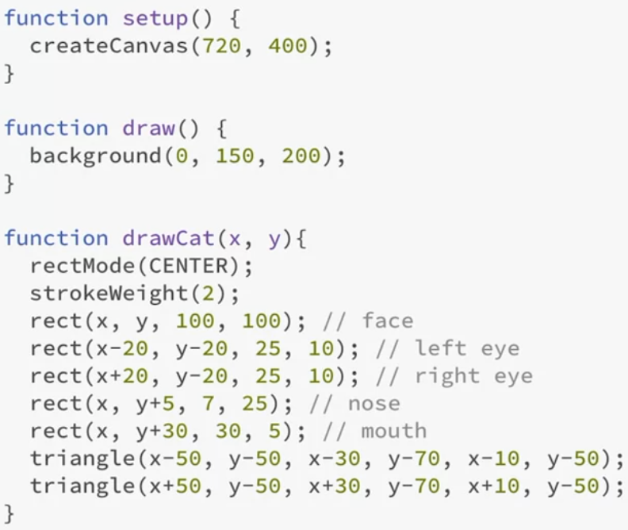
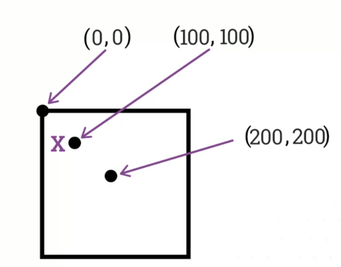
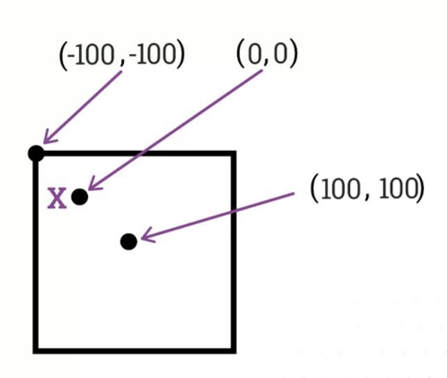

# 2D Transformations (02 to 04 examples)
- p5.js canvas works as a coordinate grid, like graph paper
- to move a primitive like rect(30,30,40,40) down and right, we add to x and y coordinates, say rect(90,90,40,40)
- it gets much complicated when trying to move composite object, like:
    - 
    - things like rotating it would be quite complicated.
    - instead we can move the 'graph paper' describing the canvas itself, in other words, moving the origin of the graph paper
    - 
    - 
- We can apply same logic to rotating objects, instead of rotating composite object- we can rotate the canvas.
- Remember that rotate does rotate canvas around origin point by specified amount of radians. 
    - use rotate(radians(degrees)) to rotate by degrees.
- Also order of translate and rotate is important
- By default, squares rotate on top right corner (origin point), this can be changed with:
    - rectMode(CENTER)
- We can also use scale() to change the size
- Translate calculates each next translation from where the origin point is at that time, not from (0,0). They trickle down.
- Alternatively, we can use push() to save where the origin was, and then pop() once the transformation has been done, and return to stored origin point. They give us temporary option to mess around with things.  

# Crash course in OOP
- Object oriented programming is paradigm based on:
    1. Attributes/Properties:
        - Objects that contain data, in the form of fields
    2. Code in the form of methods or functions
- Behaviors and properties can be encapsulated in a Class:
```
Class Ball
    Methods:
        bounce()
        move()
        inflate()
    
    Attributes:
        var color;
        var size;
```
- Then from this class we can create objects with different attributes (like a cookie cutter):
    - Basketball
    - Baseball
    - etc.