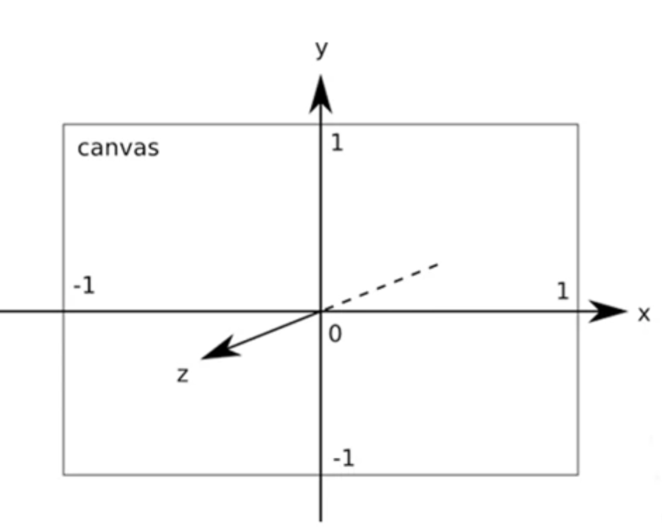
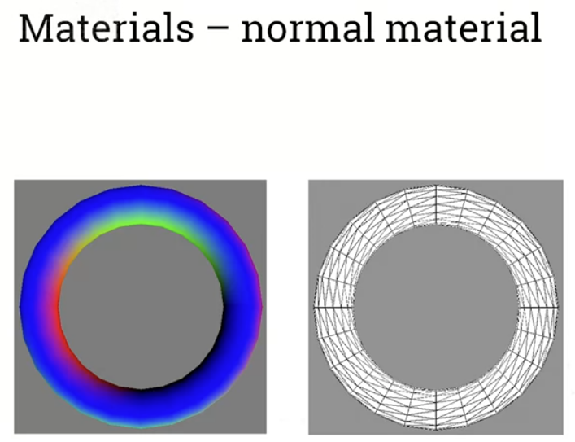
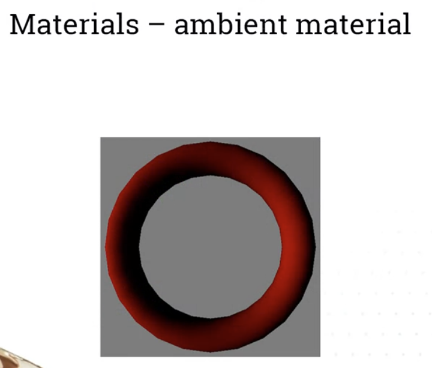
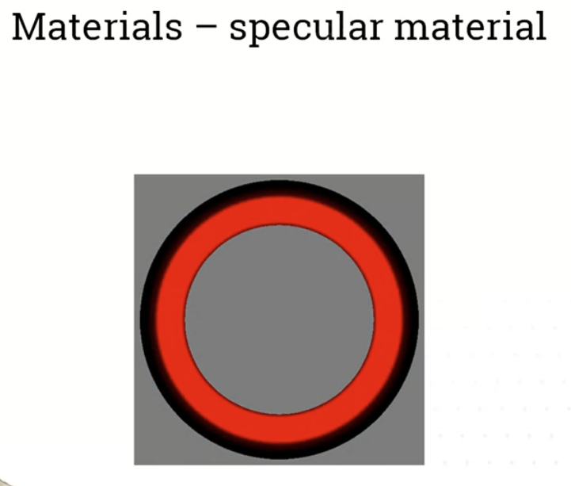
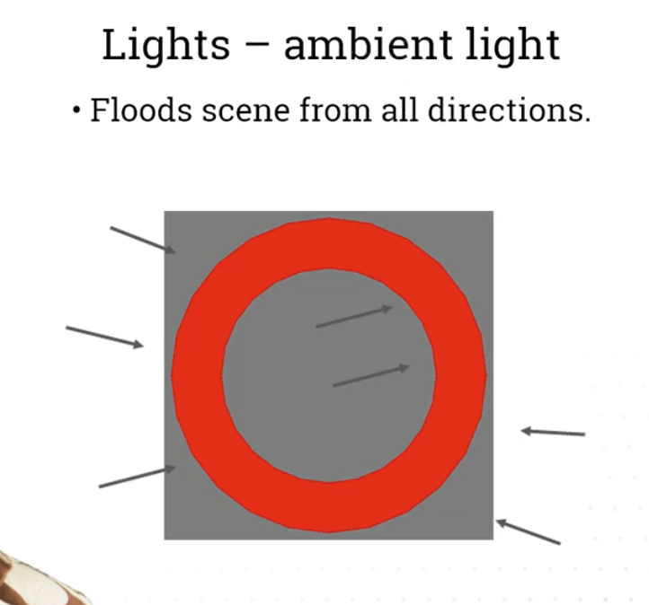
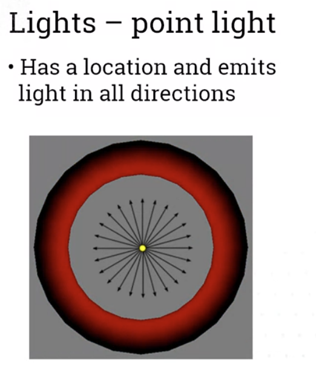
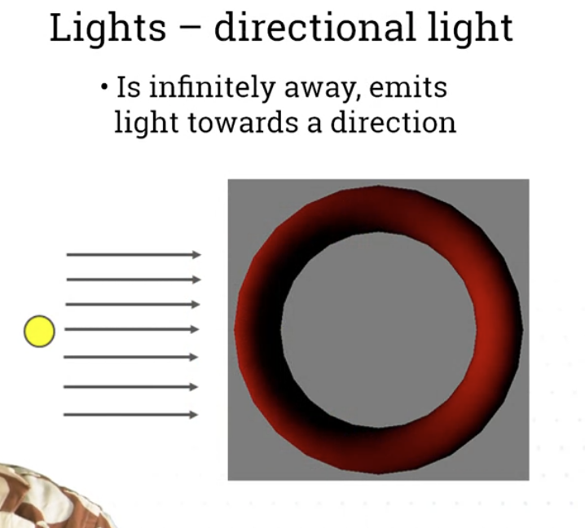
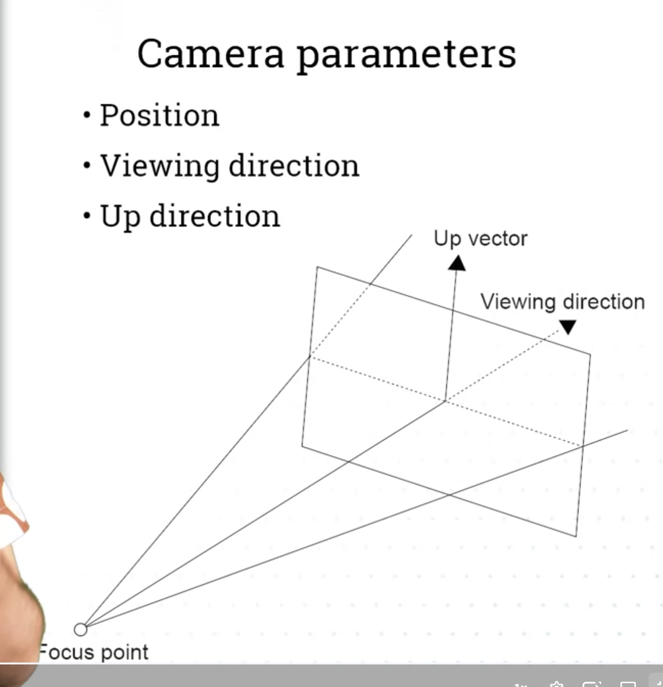
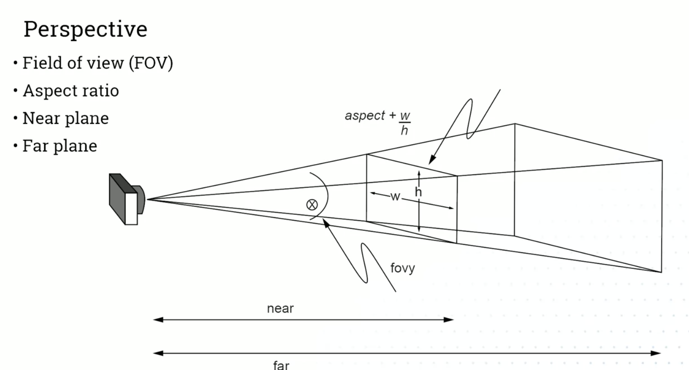
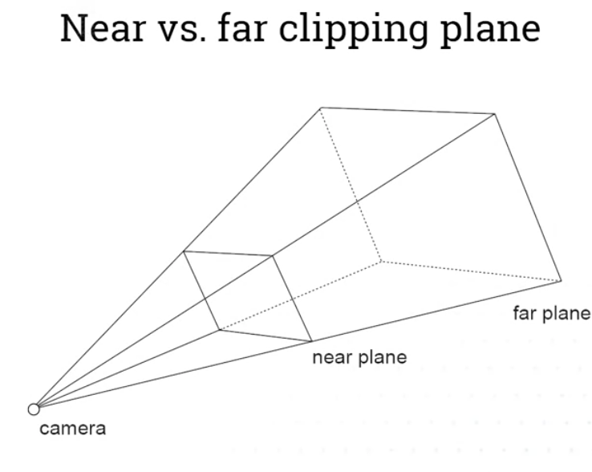

# 3D Graphics
- Rendered by WebGL (JS Web Graphics Library, linked to OpenGL), that uses GPU
- Three.js Library is very good for 3D graphics
- p5.js is not optimal for 3D, but easier , as uses same paradigm as 2D
 
 ## 3D in p5.js
- 1. createCanvas(500,500,WEBGL);
    - WebGL comes with:
        - 3D primitives
        - Textures
        - Materials
        - Lights
        - Cameras

- 2. 3D Coordinate system
    - Origin is center of the screen
    - 
    - z-axis value increase with objects being closer to You, and decrease with objects being further away

- 3. rotateX(), rotateY(), rotateZ()
- 4. translate([x],[y],[z])

## Materials and lights
- 
- 
- 

- Lights: 
    - 
    - 
    - 

- Normal material assigns
    - x value -red
    - y value -green
    - z value -red

## Camera
- Renderer creates default camera
- 

## Perspective
- 
- Anything out of area between near and far plane is clipped
- 