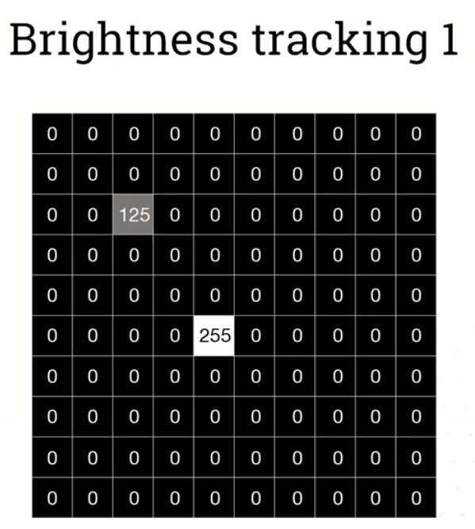
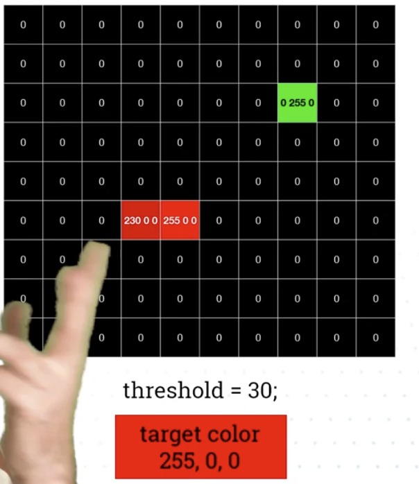
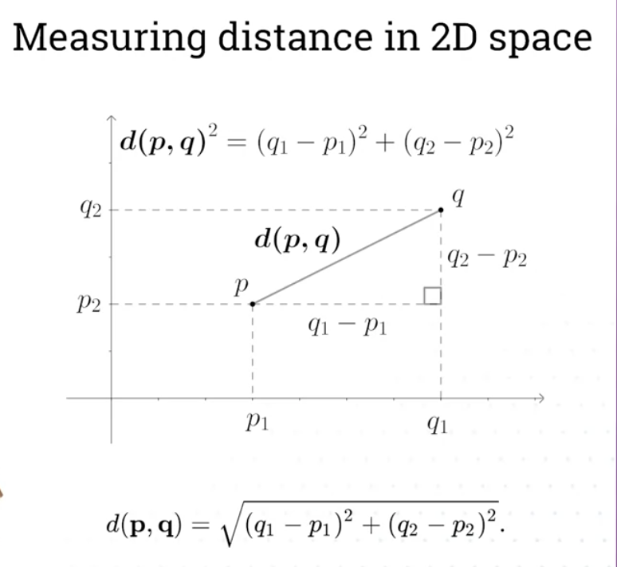
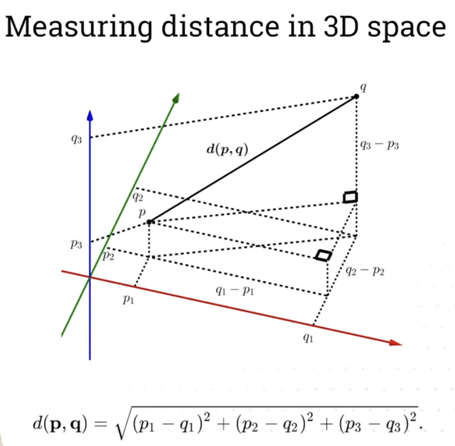
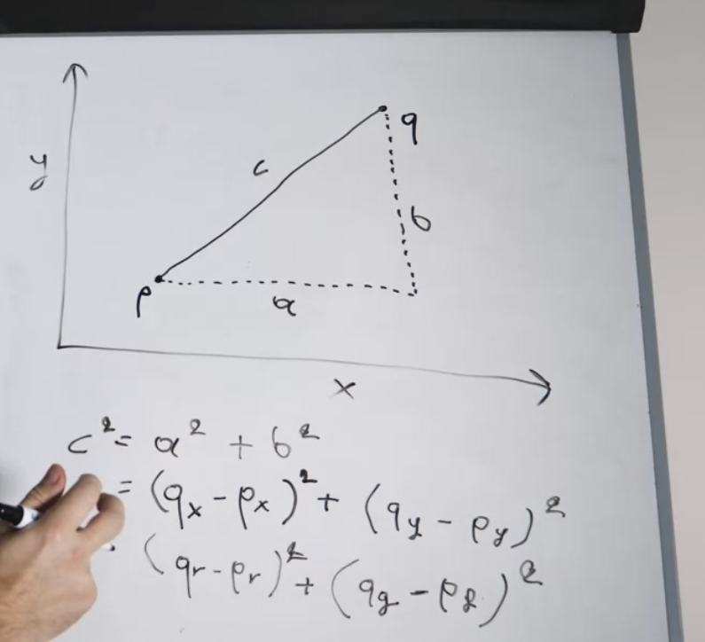
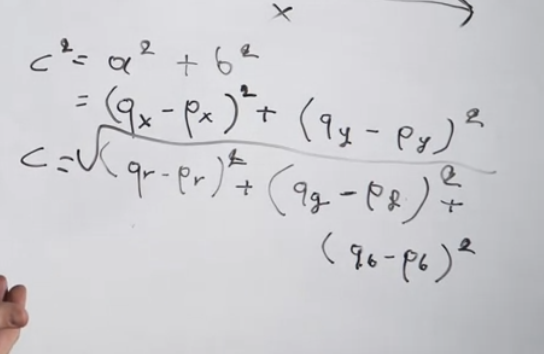

# Computer vision
## Applications of computer vision
- Post office letter routing
- Self driving cars
- Medical imaging
- Face recognition in smartphones
- Sports games use it to collect infromation about each players goals/passes etc

## Brightness tracking
- Looping over pixels in image
- Fiding brightest ones
- 
- Under assumption that the object we track is the absolute brightest object

## Color tracking
- Similar to brightness tracking, but instead of looking for bright pixels, were looking for pixels close to any specific color
- 
- 
- We can do it by tracking rgb colors as points in 3D space, and then find distance between them
- 
- We replace q and p in formula with colors:
- 2D
    - 
- 3D
    - 

## Color tracking with blobs (objects)
- 