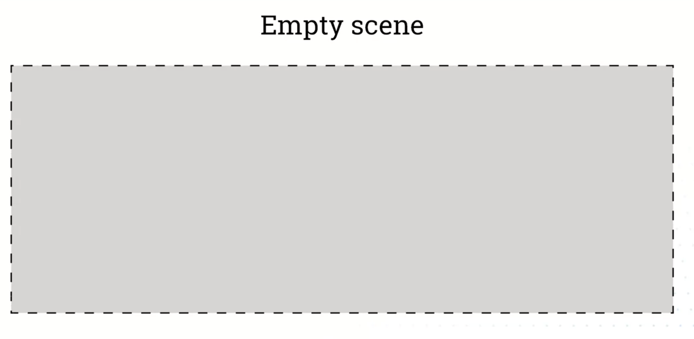
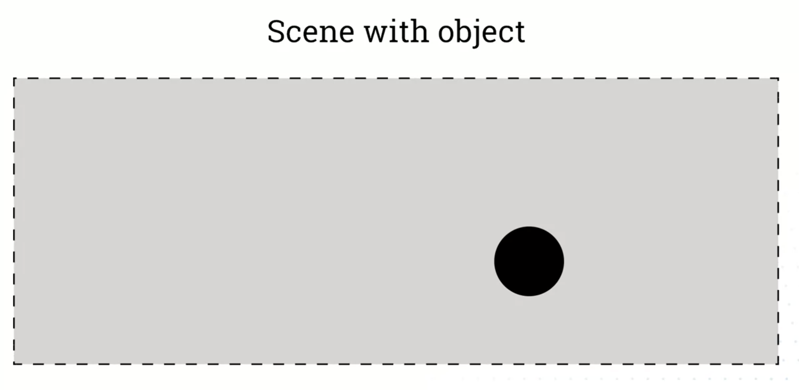
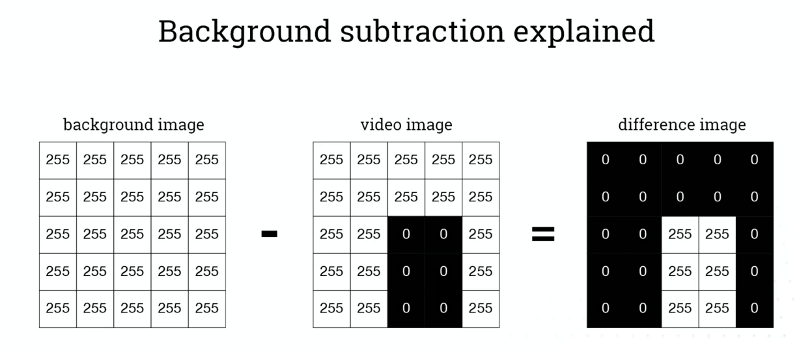
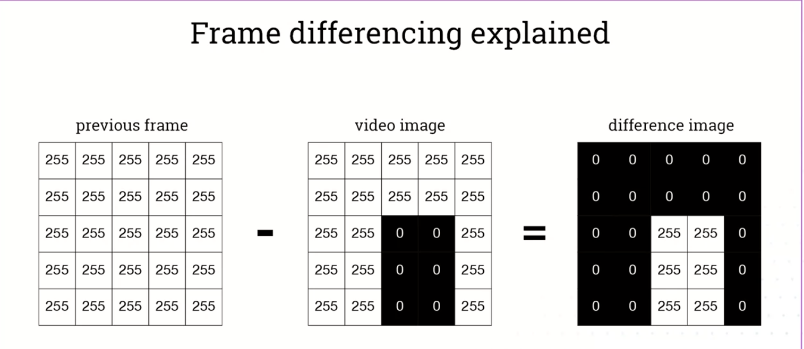

# Computer vision continued
## Background subtraction
- First we take image of scene without the object
- 
- And subtrzct the scene with the object
- 
- 
- We assume that the objects color will differ from background, and backgrund wont change
- It would not work vry well on a scene like this one:
    - 

## Frame differencing
- Used for detecting movement
- Comparing current frame with previous frame
- 