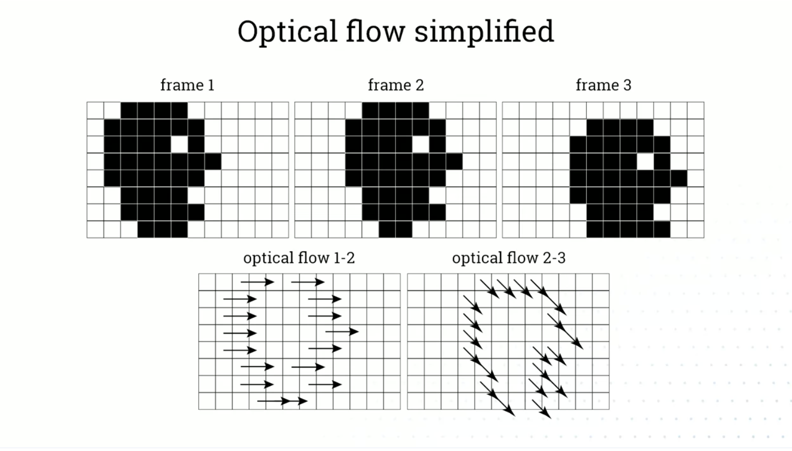
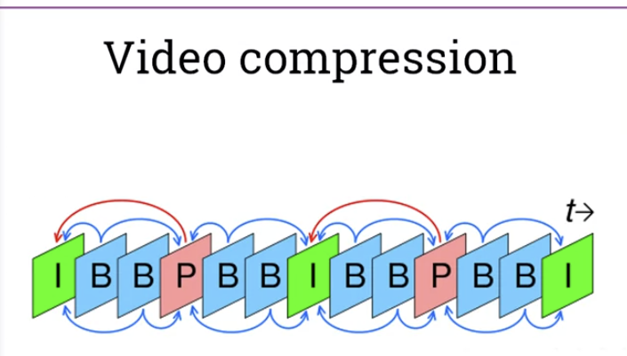
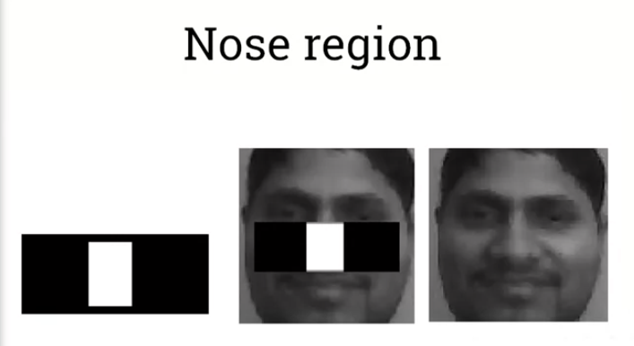
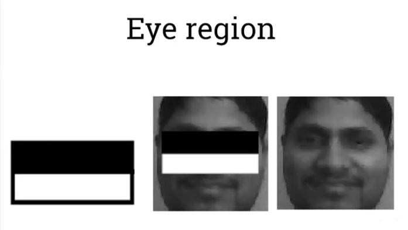

# Optical Flow
- Optical flow is defined as the apparent motion of pixels on an image. It is often good approximation of the true physical motion.
- We capture both direction and magnitude of movement
-
- Also used in video compression, where we dont describe all the pixels in every frame, but just the movement of them in frame-to-frame
- 

# Face detection
## Old but established is Viola Jones algorithm
- 
- 
- 