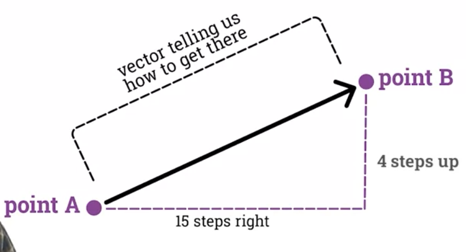
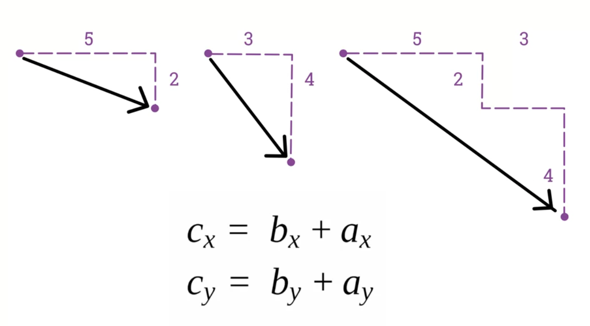

# Using Vectors
- Euclidian vectors, we mean something with direction and magnitude, usually represented by an arrow
    - 
- 
```
vector_variable = new createVector(value1,value2,value3);
vector_variable.x
vector_variable.y
vector_variable.z


```

## Vector addition and subtraction
- Addition of two vectors is addition of their two (or three) components x and y (and z if present)
    - 

## Vector scaling
- It's multiplication and division, basically. 
- Multiplying(or dividing) each component of the vector by the same scalar value

## Calculating magnitude(length) and normalising
- Calculating magnitude of a vector is pretty much using pythagoras theorem, and calculating hypotenuse
- p5.js has built in function .mag() for this.
    - It extracts magnitude of a vector
- For extracting only direction of a vector we can use .normalise()
    - Takes any vector and turns it into an unit vector, which is of size 1.
    - Normalising makes all vectors equal in size.
- Direction is calculated by:
    1. Finding magnitude of a vector.
    2. Dividing each component of a vector of that magnitude

## Acceleration
- All of the above was just an introductory material to help us start translating natural world movement concepts into graphics programming.
- For example:
    - new_location = precious_location + velocity
        - In sailing, this is known as dead reckoning, which was widely used in maritime navigation
- In p5.js we can do this by using:
    - location.add(velocity)

## Static functions
- Static functions are functions we call from class name itself, not from object instance:
    - Regular way (modifies vector1 in the process):
        - vector1.add(vector2)
    - Static way (keeps original vectors unchanged, returns result as a new vector):
        - vector3 = p5.Vector.add(vector1,vector2)

