# Forces of physics
- A force is a vector that causes an object with mass to accelerate.
- Combining multiple forces (gravity, weight etc) allows us to make more realistic simulations of the world

## Newtons First law of physics
- An object at rest stays at rest and an object in motion stays in motion.
    - Unless there is a force acting on the object, it won't change it's velocity
- p5.js velocity vector will not change unless the object is acted upon

## Newtons Second law of hysics
- Force = Mass * Acceleration
- Acceleration = Force/Mass
- Acceleration is proportional to mass. 

- In p5.js, if we assume Mass=1 --> Acceleration = Force, therefore:
    
    ```
    applyForce(force) {
        acceleration = force
    }
    ```
    - But this means we can only apply one force at the time, and adding a new one will override the previos one.

### Force accumulation:
- Multiple forces can act on an object:
    - Gravity
    - Wind
    - Friction
    - etc
    - 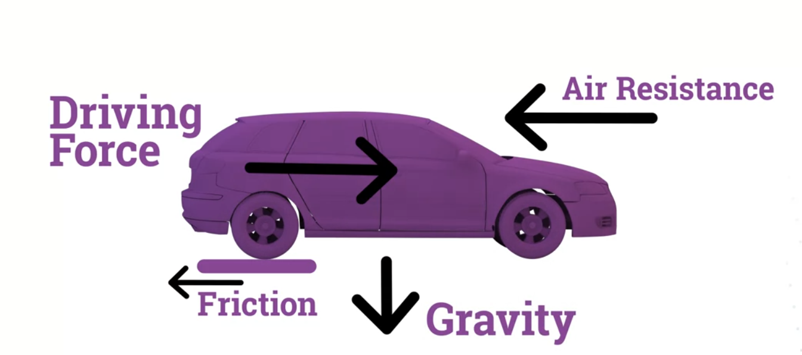
- To account for multiple forces, we add (accumulate them):
    -
        ```
            applyForce(force) {
                acceleration.add(force);
                }

            car.applyForce(gravity);
            car.applyForce(friction);
            car.applyForce(wind);
            car.applyForce(engine);
        ```
- So in the end we have forces affecting acceleration, which in turn affects velocity, which in turn affects location. This chain/waterfall of calculations allows complexity to emerge.


## Gravity and friction
- Gravity is a natural force by which all things with mass are attracted to one another.
    - in p5.js a vector with values (0, 0.1) is added to acceleration
- Friction is the force resistng the relative motion of the objects sliding against each other
    - In p5.js we:
        1. Get the velocity vector 
        2. Calculate the opposite vector
        3. Scale by a fricion coefficient (dictates how much friction between two objects), we normally use 0.01
        4. Apply to object

## Collision detection
- Computational problem of detecting intersection of two or more objects, which can become complicated and computationaly expensive if dealing with complicated and/or many objects.
    - 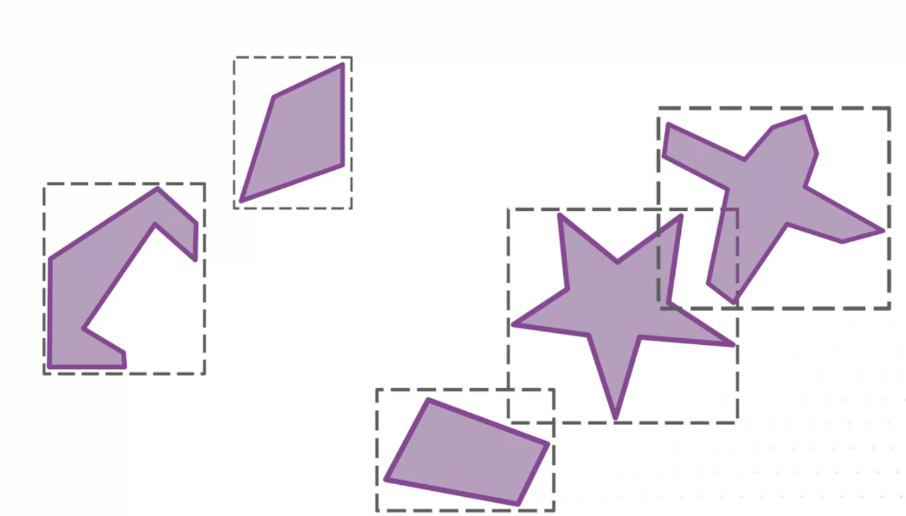
- Collision detection process usually is divided in two phases:
    - 1. BROAD PHASE:
        - Finding pairs of rigid bodies that 'might' be colliding with each other, and exclude pairs that certainly arent colliding
        - To optimize this phase, physics engines often use space partitioning and bounding boxes
            - Bounding boxes is an attempt to simplify the comparison between complicated shapes, instead of going through all of the vertices of each shape to see if there's an overlap.
                - 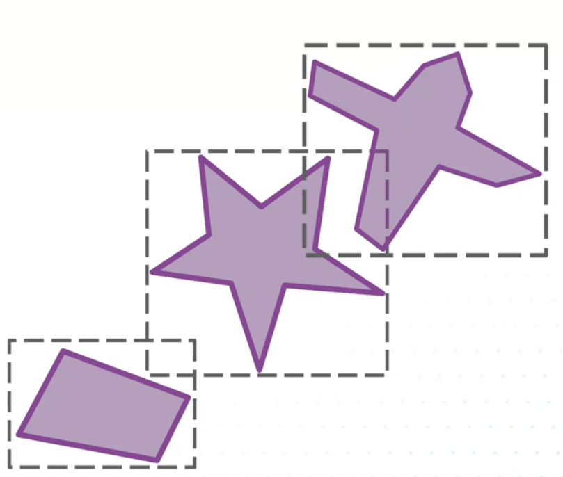
        - There are many spece partitioning algorithms:
            - Uniform Grids
            - Octrees in 3D
            - Spatial Hashing
            - Sort and Sweep
            - Quadtree
        - Quadtree:
            - Data structure to divide 2D region in more managable parts.
            - Starts as a single node
            - Initially objects added to the space are added to the single node of the quadtree.
                - 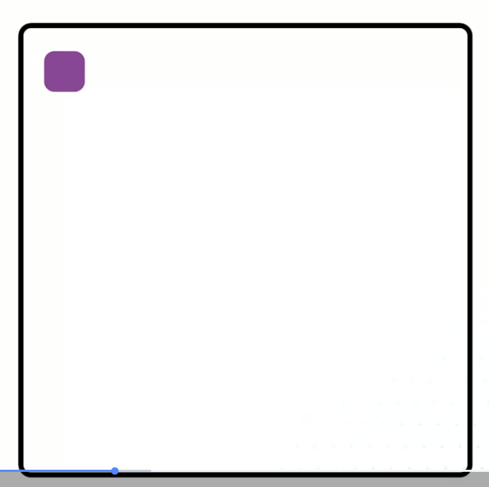
            - When more objects are added in the space, quadtree will eventually split into four subnodes.
            - Each object will then be put into one of those subnodes according to where it lies in the 2D space.
                - 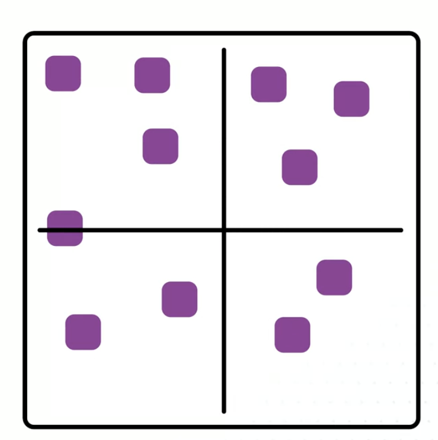
            - Any object that cannot fully fit inside the nodes boundaries will be placed in the parent node.
                -  
            - Each subnode can continue subdividing as more objects are added.
                - 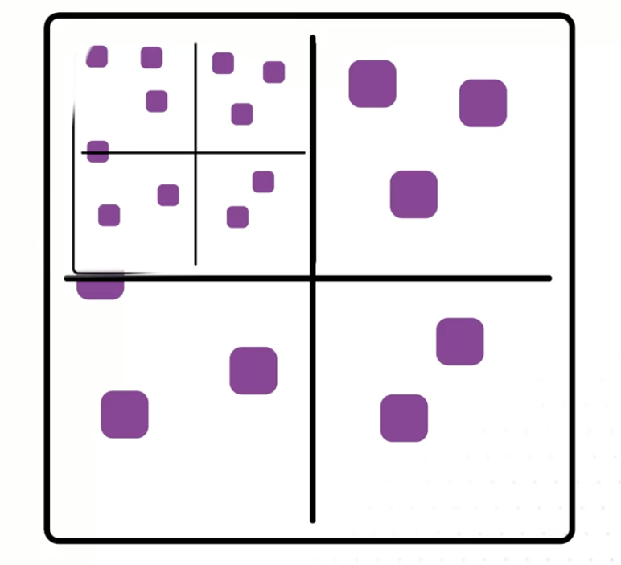
            - Example with 2D space containing 500 balls using Quadtree to detect collisions:
                - 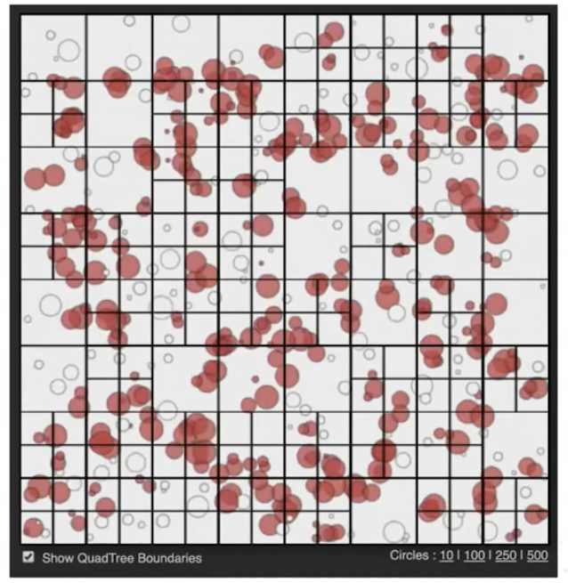

    - 2. Narrow:
        - Physics engines have a number of different classes of shapes, such as:
            - Circles
            - Edges
            - Convex polygons
        - For each pair of shape type, there is a specific collision detection algorithm
        - Possibly simplest collision detection algorithm is circle based:
            - 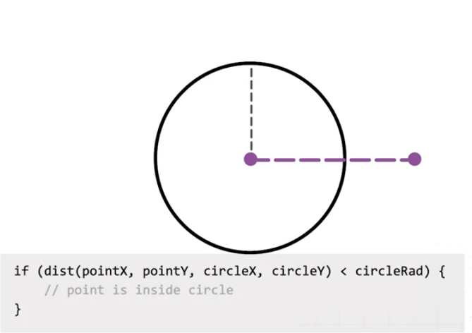
            - 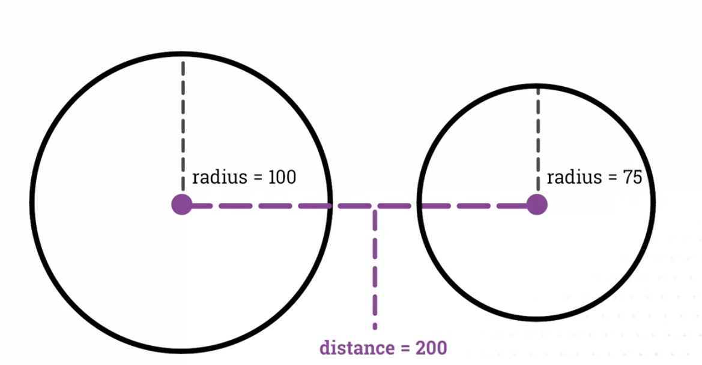
            - 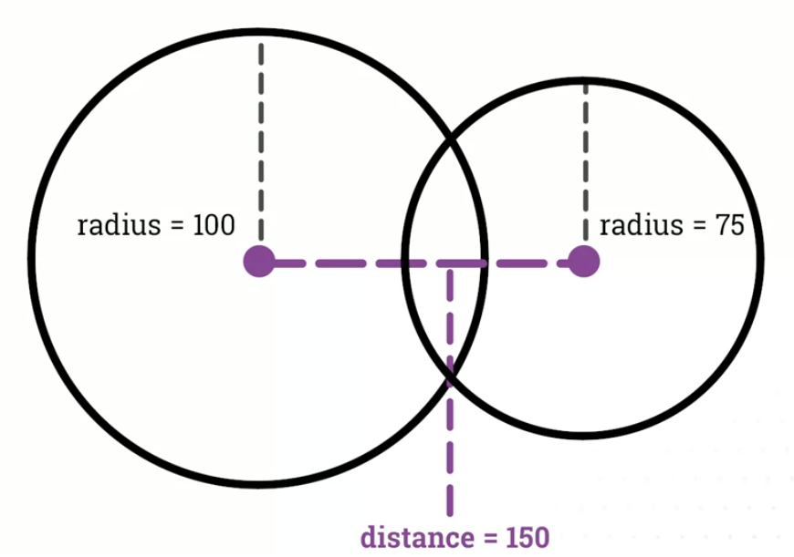
            - 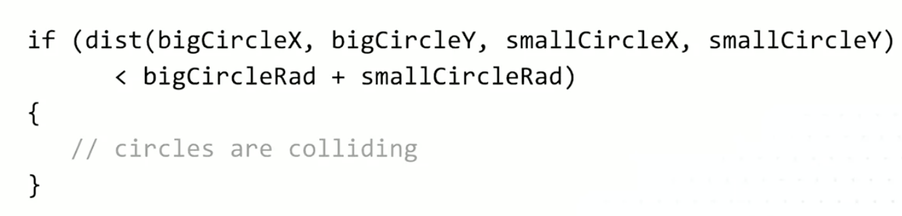