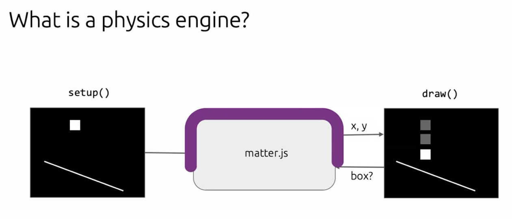
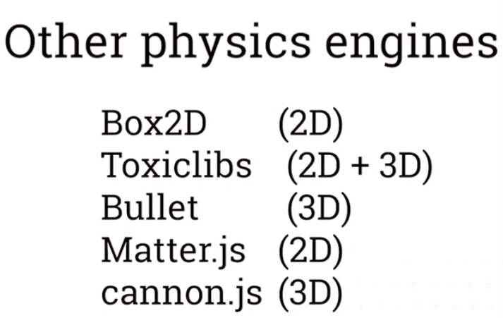
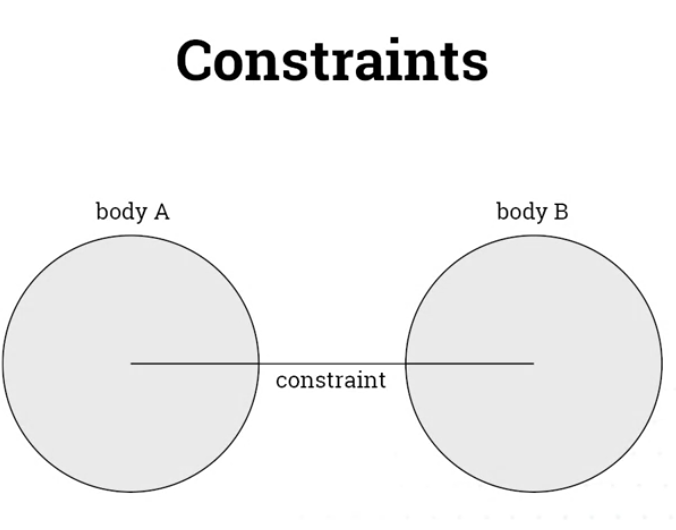
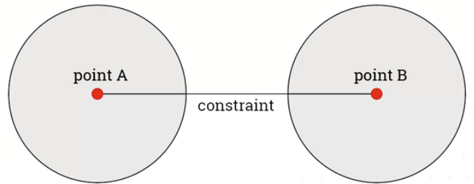

# matter.js
- 
- Now that we understand how physics engines work under the hood, we can go another abstraction layer higher, and use an already made black box physics engine.
- Other physics engines:
    - 
- matter.js resources:
     -https://www.coursera.org/learn/uol-graphics-programming/supplement/8UlSW/matter-js-resources

## Constraints
- Constraint is an entity that connects two bodies together, this connection has no geometry(therefore things can pass through it), and serves the sole purpose of onnecting two bodies together
- 
- To connect two bodies together, we need to provide the constraint with two bodies (A and B), and a place on each body for the constraint to be attached to.
- 