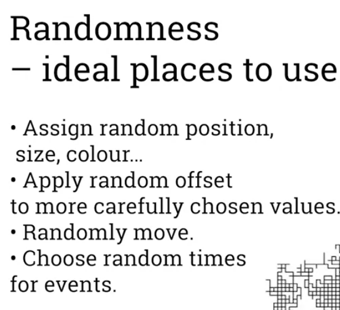
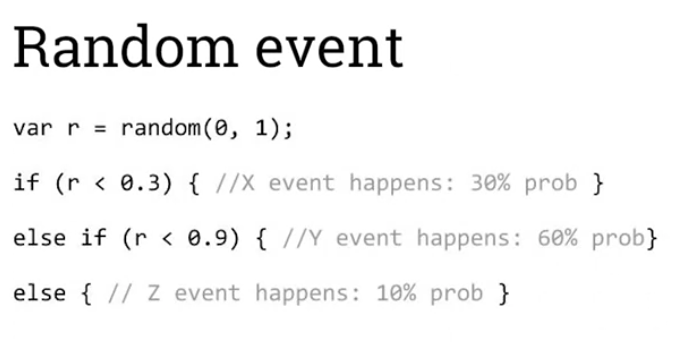
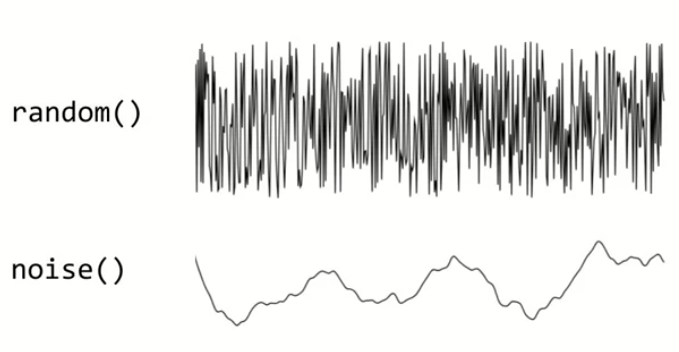

# Generative art and design
- > Generative art refers to art that, in part or in whole, has been created with a use of an autonomous system 
- Art is emotional and subjective field with debatable definition
- Used widely in videogames for procedural world generation (Minecraft, No Mans Sky, Civilization etc.)

## Nature and use of randomness
- One of the main pillars of generative art is randomness
- Generates unpredictable outcomes.
- For example dice is predictable, but it is extremely sensitive to small changes in input.
- Popular way of generating randomness is measuring radioactive decay
- Computers normally generate pseudo-random numbers, dependant on seed value
- 
- 

## Perlin noise
- An algorithm for designing procedural textures
- First used in the film Tron(1982)
- Examples done by Perlin noise:
    - 
- Perlin Noise takes into account what happened exactly before it
    - 
- Could be compared to vynil player needle reading specific points on crumbled and then straightened piece of paper, including the natural flow of numbers.