# Generative techniques part 2, sine and fractals
## Trigonometry refresher
- 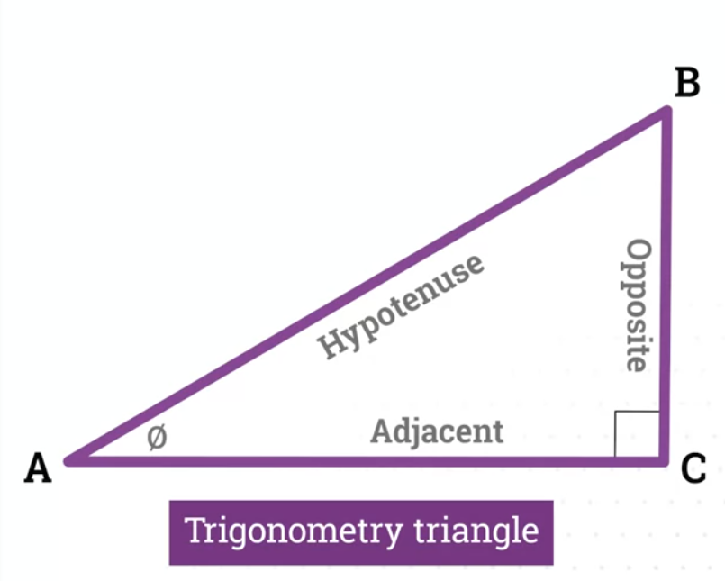
- 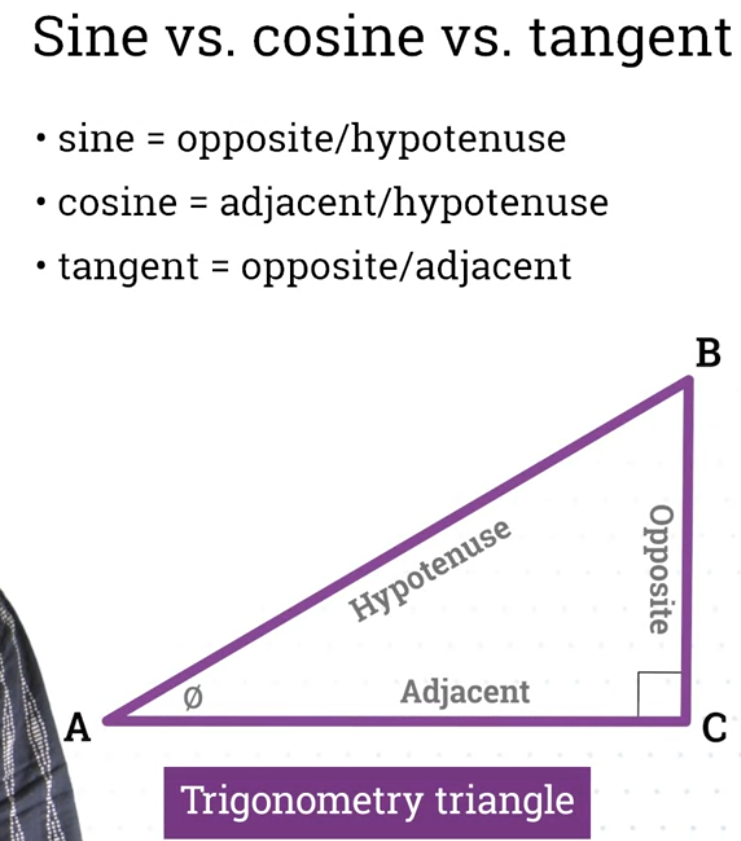
- Bigger the angle theta, longer the Opposite side
- 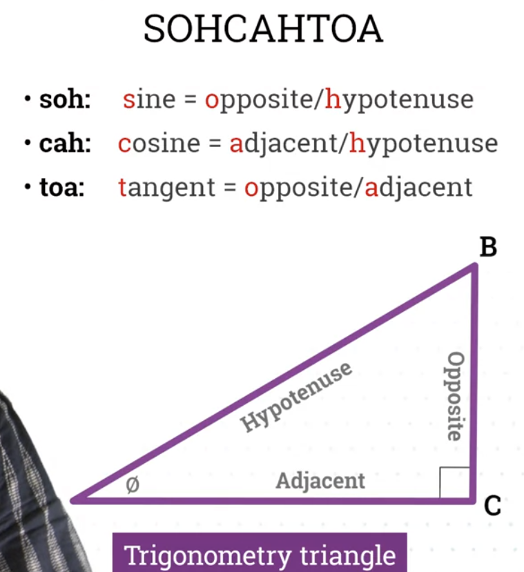

## Polar to cartesian coordinates
- 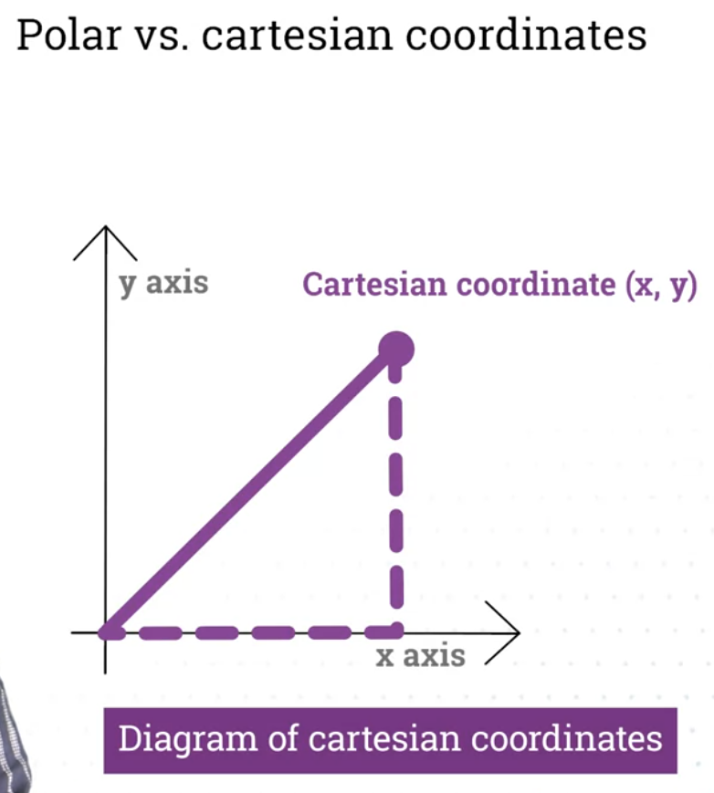
- 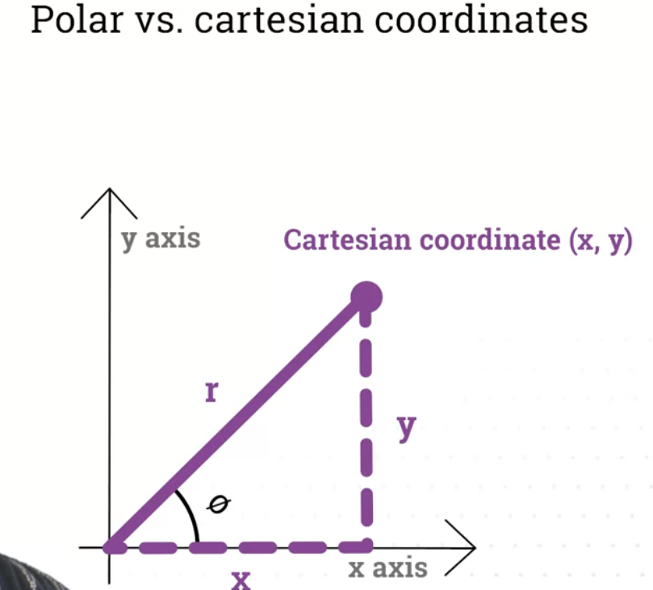
- 2pi radians = 360 degrees
- 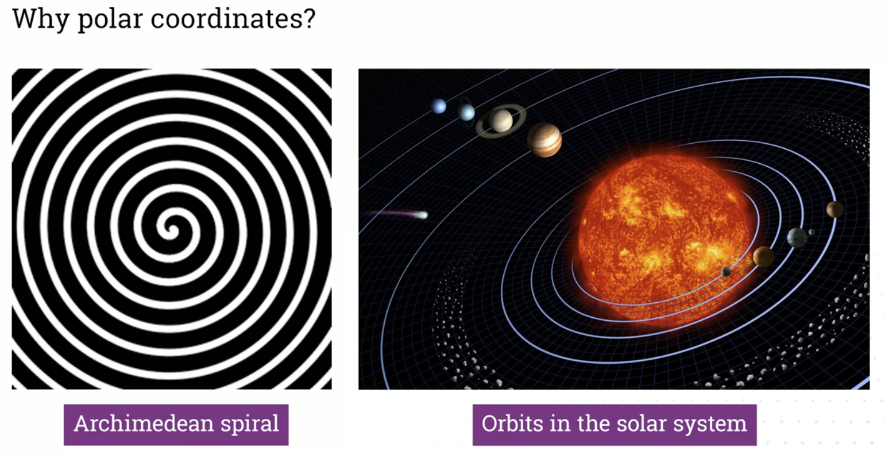
- 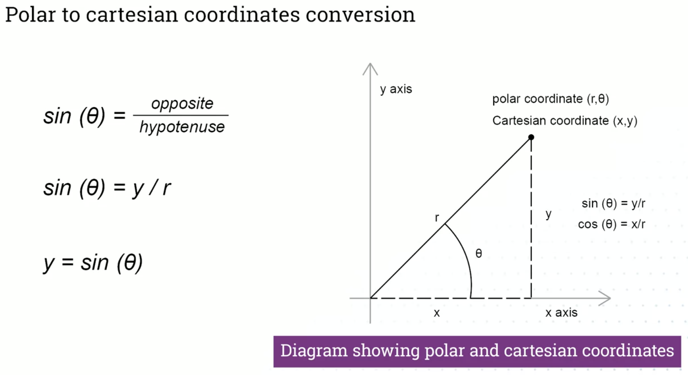
- 
- 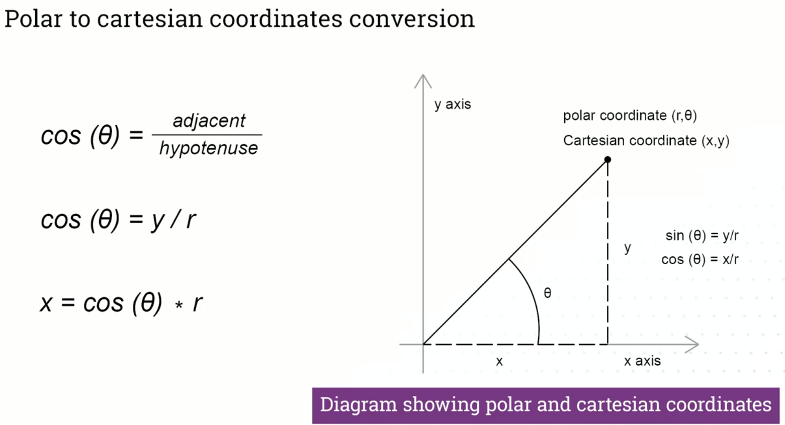
- 

## Oscilation
-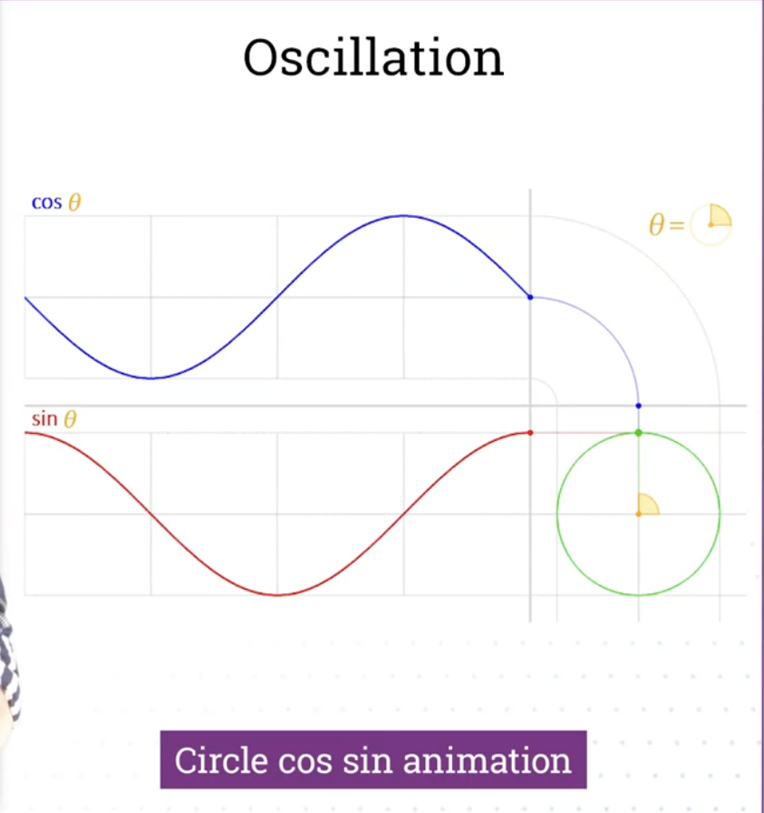
- 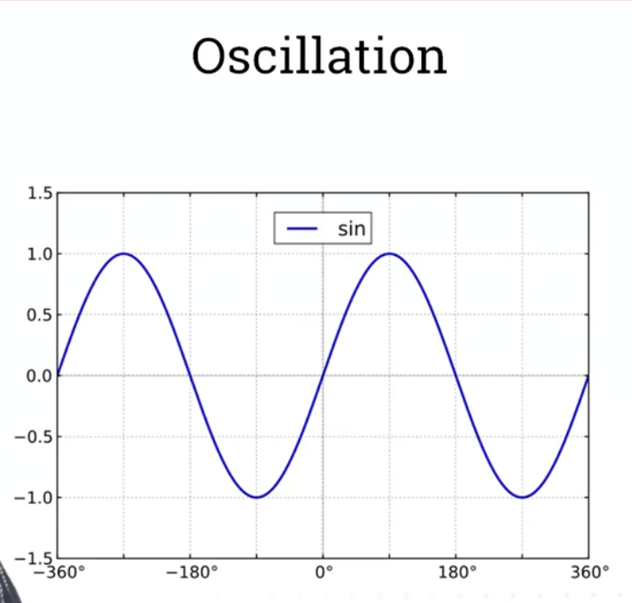
- 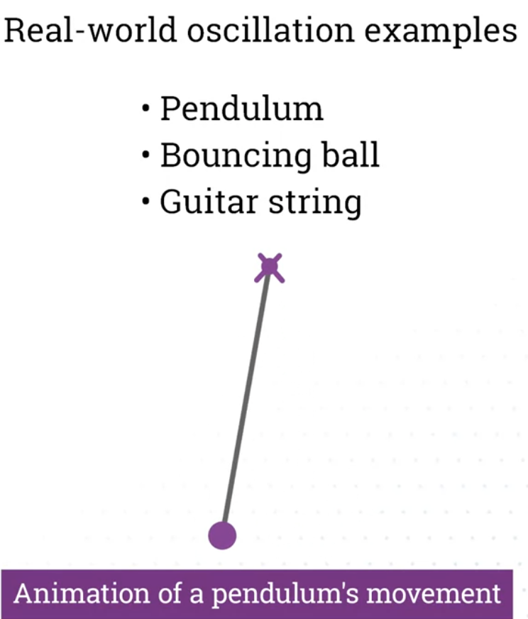
- 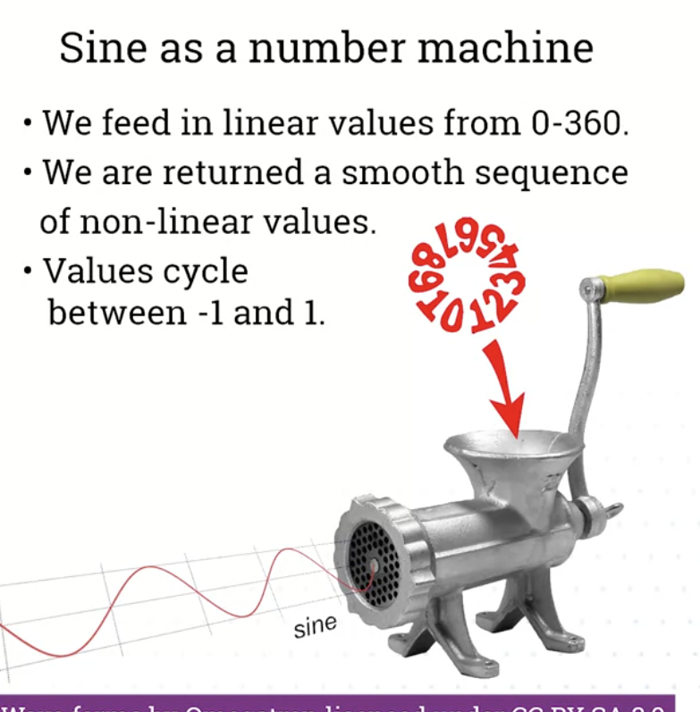
- 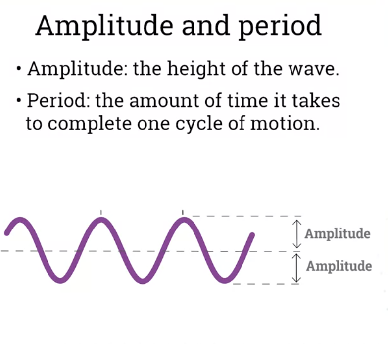
- 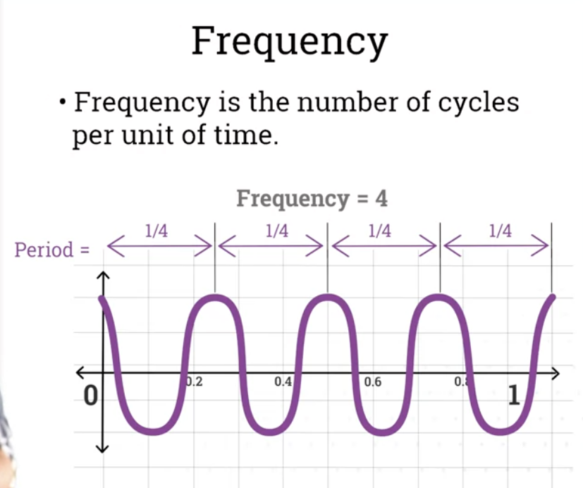
- 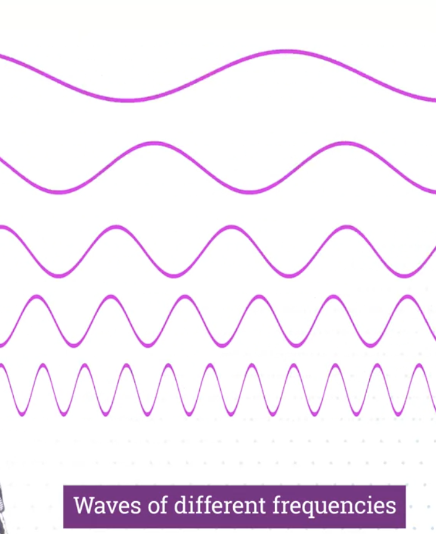
- 